# Approval Orchestrator

## What I Built

I created a complete approval workflow management system that solves a real problem: **getting things approved quickly and transparently**. You know how frustrating it can be when you need approval for something important, but you're stuck waiting in email chains or Slack threads? This system changes that entirely.

## The Story Behind This Project

Every organization has approval processes - whether it's approving a purchase, deploying code, or signing off on a marketing campaign. But most of these processes are manual, slow, and lack visibility. I wanted to build something that would:

- **Make approvals fast and transparent** - Everyone knows exactly where things stand
- **Work with existing tools** - Integrate with Slack and email, not replace them
- **Provide real insights** - See bottlenecks and optimize your processes
- **Handle complex scenarios** - Support rollbacks when things go wrong

## How It Works

Here's the complete flow of how the system works:

```mermaid
graph TD
    A[👤 User Creates Workflow] --> B[📝 Define Approval Steps]
    B --> C{📢 Choose Notification Channel}
    C -->|Web| D[🌐 Web Dashboard]
    C -->|Slack| E[💬 Slack Webhook]
    C -->|Email| F[📧 Email Notification]
    
    D --> G[⏰ Pending Approval]
    E --> G
    F --> G
    
    G --> H{🤔 Approver Decision}
    H -->|✅ Approve| I[🎉 Step Approved]
    H -->|❌ Reject| J[🚫 Step Rejected]
    H -->|⏱️ Timeout| K[⚠️ Step Expired]
    
    I --> L{🔄 More Steps?}
    L -->|Yes| M[➡️ Next Step]
    L -->|No| N[✨ Workflow Complete]
    
    J --> O[💔 Workflow Failed]
    K --> O
    
    M --> C
    N --> P[📊 Analytics Update]
    O --> P
    
    P --> Q[🔔 Real-time Updates via WebSocket]
    
    subgraph "🔄 Rollback System"
        R[🚨 Rollback Triggered] --> S[📋 Compensation Actions]
        S --> T[📧 Notify Stakeholders]
        T --> U[📝 Audit Trail]
    end
    
    N -.-> R
    O -.-> R
```



## The System Architecture

I built this as a full-stack application with a clean separation between frontend and backend:

```mermaid
graph TB
    subgraph "🎨 Frontend (React + Vite)"
        A[🏠 Home Dashboard]
        B[📊 Analytics Page]
        C[⚙️ Create Workflow]
        D[📋 Workflow Detail]
        E[✅ Approval Management]
    end
    
    subgraph "🔄 Real-time Layer"
        F[⚡ WebSocket Server]
        G[🔔 Event Bus]
    end
    
    subgraph "🚀 Backend (Node.js + Express)"
        H[🛣️ API Routes]
        I[💾 Data Models]
        J[🔌 Integrations]
        K[⏲️ Background Jobs]
    end
    
    subgraph "📡 External Services"
        L[💬 Slack Webhooks]
        M[📧 Email SMTP]
        N[💾 SQLite Database]
    end
    
    A --> H
    B --> H
    C --> H
    D --> H
    E --> H
    
    H --> F
    F --> G
    G --> A
    G --> B
    G --> D
    G --> E
    
    H --> I
    I --> N
    H --> J
    J --> L
    J --> M
    H --> K
    K --> N
```



## What Makes This Special

### 🚀 Real-time Everything
I implemented WebSocket connections so when someone approves something, everyone sees it instantly. No more refreshing pages or wondering if your approval went through.

### 🎯 Smart Notifications
The system is smart about how it notifies people:
- **Slack integration** sends interactive messages with approve/reject buttons
- **Email notifications** include direct action links
- **Web dashboard** shows everything in a beautiful, organized interface

### 📊 Built-in Analytics
I added comprehensive analytics because data drives better decisions:
- See how long approvals typically take
- Identify bottlenecks in your processes
- Track completion rates and success metrics
- Visualize everything with beautiful charts using Recharts

### 🔄 Sophisticated Rollback System
Sometimes you need to undo things. I built a complete rollback system that:
- Reverts workflows to previous states
- Executes compensation actions automatically
- Maintains a complete audit trail
- Notifies all stakeholders about the rollback

## The Technical Implementation

### What I Used and Why

**Frontend (React 19 + Vite)**
- React 19 for the latest features and performance
- Tailwind CSS for rapid, consistent styling
- React Router for smooth navigation
- Recharts for beautiful data visualizations
- Axios for clean API communication

**Backend (Node.js + Express)**
- Express.js for a robust API foundation
- Socket.io for real-time bidirectional communication
- SQLite for development (easily upgradable to PostgreSQL/MySQL)
- Nodemailer for flexible email sending
- UUID for secure, unique identifiers

**Key Integrations I Built**
- **Slack Webhook Integration** - Send rich notifications with action buttons
- **Email Integration** - SMTP support with HTML templates and fallback to test accounts
- **Background Job System** - Automatic cleanup of expired approvals

## Getting Started

### Quick Setup
```bash
# Clone and install
git clone <your-repo>
cd approval-orchestrator
npm install

# Setup backend
cd backend
npm install
cp .env.example .env  # Configure your settings

# Setup frontend  
cd ../frontend
npm install

# Run both servers
npm run dev  # From root directory
```

### Environment Configuration
I made configuration straightforward with environment variables:

```env
# Basic setup
PORT=8000

# Slack integration (optional but recommended)
SLACK_WEBHOOK_URL=your-slack-webhook-url

# Email setup (uses test accounts if not configured)
EMAIL_HOST=your-smtp-host
EMAIL_USER=your-email
EMAIL_PASS=your-password
```

## How the Workflow Process Works

### 1. Creating a Workflow


### 2. Adding Approval Steps


### 3. Processing Approvals


## The Analytics Dashboard I Built

I created a comprehensive analytics system that tracks:

- **Workflow Performance** - Average completion times, success rates
- **Approval Patterns** - Which steps take longest, who approves fastest
- **Activity Timeline** - Complete audit trail of all actions
- **Real-time Metrics** - Live updates of pending approvals and completed workflows

## What's Next

This system is designed to grow. Some ideas for future enhancements:
- **Microsoft Teams integration** for broader collaboration
- **Advanced approval routing** based on business rules
- **API integrations** with external systems
- **Mobile app** for approvals on the go
- **Advanced reporting** with custom dashboards

## Why I Built This

I've seen too many great ideas get stuck in approval limbo. This system ensures that:
- **Nothing gets lost** - Every approval request is tracked
- **Decisions are fast** - Multiple notification channels mean quick responses
- **Processes improve** - Analytics help you optimize your workflows
- **Mistakes are fixable** - Rollback system handles when things go wrong

The result is a system that makes approval processes a competitive advantage rather than a bottleneck.

---

*Built with passion for solving real workflow problems* ⚡