# Approval Orchestrator

> A modern, intelligent approval workflow management system that transforms chaotic approval processes into streamlined, transparent workflows.

[](https://nodejs.org/)
[](https://reactjs.org/)
[](LICENSE)
[](CONTRIBUTING.md)

## 🚀 What This System Solves

Every organization struggles with approval bottlenecks. Whether it's:
- 💰 **Budget approvals** stuck in email chains
- 🚀 **Deployment requests** lost in Slack threads  
- 📋 **Document reviews** with unclear status
- 🔄 **Multi-step processes** without visibility

**Approval Orchestrator** eliminates these pain points by providing a centralized, intelligent system that integrates with your existing tools while giving you complete visibility and control.

## ✨ Key Features

### 🎯 **Multi-Channel Notifications**
- **Slack Integration**: Interactive messages with one-click approve/reject buttons
- **Email Notifications**: Rich HTML emails with direct action links  
- **Web Dashboard**: Beautiful, responsive interface for all approval activities

### 📊 **Powerful Analytics & Insights**
- **Performance Metrics**: Track approval times, completion rates, and bottlenecks
- **Visual Dashboards**: Beautiful charts powered by Recharts
- **Activity Timeline**: Complete audit trail of all workflow activities
- **Auto-refresh**: Dashboard updates every 30 seconds for near real-time insights

### 🔄 **Advanced Workflow Management**
- **Smart Rollbacks**: Revert workflows with automated compensation actions
- **Flexible Routing**: Configure complex approval chains with conditional logic
- **Timeout Handling**: Automatic escalation and cleanup of expired approvals
- **Status Tracking**: Real-time visibility into every step of your workflows

### 🛡️ **Enterprise-Ready Features**
- **Audit Trail**: Complete history of all decisions and actions
- **Security**: Built-in security headers and input validation
- **Scalability**: SQLite for development, easy upgrade to PostgreSQL/MySQL
- **Background Jobs**: Automated cleanup and maintenance tasks

## How It Works

Here's the complete flow of how the system works:

```mermaid
graph TD
    A[👤 User Creates Workflow] --> B[📝 Define Approval Steps]
    B --> C{📢 Choose Notification Channel}
    C -->|Web| D[🌐 Web Dashboard]
    C -->|Slack| E[💬 Slack Webhook]
    C -->|Email| F[📧 Email Notification]
    
    D --> G[⏰ Pending Approval]
    E --> G
    F --> G
    
    G --> H{🤔 Approver Decision}
    H -->|✅ Approve| I[🎉 Step Approved]
    H -->|❌ Reject| J[🚫 Step Rejected]
    H -->|⏱️ Timeout| K[⚠️ Step Expired]
    
    I --> L{🔄 More Steps?}
    L -->|Yes| M[➡️ Next Step]
    L -->|No| N[✨ Workflow Complete]
    
    J --> O[💔 Workflow Failed]
    K --> O
    
    M --> C
    N --> P[📊 Analytics Update]
    O --> P

    subgraph "🔄 Rollback System"
        R[🚨 Rollback Triggered] --> S[📋 Compensation Actions]
        S --> T[📧 Notify Stakeholders]
        T --> U[📝 Audit Trail]
    end
    
    N -.-> R
    O -.-> R
```



## 🏗️ System Architecture

Built as a modern full-stack application with clean separation of concerns:

```mermaid
graph TB
    subgraph "🎨 Frontend (React + Vite)"
        A[🏠 Home Dashboard]
        B[📊 Analytics Page]
        C[⚙️ Create Workflow]
        D[📋 Workflow Detail]
        E[✅ Approval Management]
    end
    
    subgraph "🔄 Backend Infrastructure"
        F[⚡ WebSocket Setup Future]
        G[🔔 Event System]
    end
    
    subgraph "🚀 Backend (Node.js + Express)"
        H[🛣️ API Routes]
        I[💾 Data Models]
        J[🔌 Integrations]
        K[⏲️ Background Jobs]
    end
    
    subgraph "📡 External Services"
        L[💬 Slack Webhooks]
        M[📧 Email SMTP]
        N[💾 SQLite Database]
    end
    
    A --> H
    B --> H
    C --> H
    D --> H
    E --> H
    
    H --> F
    F --> G
    G --> A
    G --> B
    G --> D
    G --> E
    
    H --> I
    I --> N
    H --> J
    J --> L
    J --> M
    H --> K
    K --> N
```



## 🛠️ Technology Stack

### Frontend
| Technology | Purpose | Version |
|------------|---------|---------|
| **React** | UI Framework | 19+ |
| **Vite** | Build Tool & Dev Server | Latest |
| **Tailwind CSS** | Styling Framework | 4+ |
| **React Router** | Client-side Routing | 6+ |
| **Axios** | HTTP Client | Latest |

### Backend
| Technology | Purpose | Version |
|------------|---------|---------|
| **Node.js** | Runtime Environment | 18+ |
| **Express.js** | Web Framework | 4+ |
| **Socket.io** | WebSocket Server | 4+ |
| **SQLite** | Database (Development) | 5+ |
| **Nodemailer** | Email Service | 6+ |
| **UUID** | Unique Identifiers | 9+ |
| **Cron Jobs** | Background Task Scheduling | Built-in |

### Integrations & Tools
- **Slack Webhooks** - Rich notification delivery
- **SMTP Email** - Multi-provider email support
- **Background Jobs** - Automated maintenance tasks
- **Security Middleware** - Helmet.js protection
- **CORS** - Cross-origin request handling

## 🚀 Quick Start

### Prerequisites
- **Node.js** 18+ and npm
- **Git** for cloning the repository
- **SMTP Account** (optional, for email notifications)
- **Slack Workspace** (optional, for Slack integration)

### Installation

1. **Clone the repository**
```bash
git clone https://github.com/Kushagra1122/approval-orchestrator.git
cd approval-orchestrator
```

2. **Install dependencies**
```bash
# Install root dependencies
npm install

# Install backend dependencies
cd backend && npm install

# Install frontend dependencies
cd ../frontend && npm install
```

3. **Configure environment**
```bash
# Copy environment template
cd backend
cp .env.example .env

# Edit .env with your settings
nano .env
```

4. **Start the application**
```bash
# Development mode (from project root)
npm run dev

# Or start separately:
# Terminal 1: Backend
cd backend && npm run dev

# Terminal 2: Frontend  
cd frontend && npm run dev
```

5. **Access the application**
- **Frontend**: http://localhost:5173
- **Backend API**: http://localhost:8000

### ⚙️ Configuration

#### Required Environment Variables
```bash
# Server Configuration
PORT=8000                          # Backend server port

# Slack Integration (Optional)
SLACK_WEBHOOK_URL=https://hooks.slack.com/services/YOUR/SLACK/WEBHOOK

# Email Configuration (Optional)
EMAIL_HOST=smtp.gmail.com          # SMTP server
EMAIL_PORT=587                     # SMTP port
EMAIL_SECURE=false                 # Use TLS
EMAIL_USER=your-email@gmail.com    # SMTP username
EMAIL_PASS=your-app-password       # SMTP password
EMAIL_FROM=no-reply@yourdomain.com # From address
EMAIL_ADMIN=admin@yourdomain.com   # Admin notifications
```

#### 📧 Email Setup Examples

**Gmail**
```bash
EMAIL_HOST=smtp.gmail.com
EMAIL_PORT=587
EMAIL_SECURE=false
EMAIL_USER=your-gmail@gmail.com
EMAIL_PASS=your-app-password  # Generate in Google Account settings
```

## 🎯 Usage Guide

### Creating Your First Workflow

1. **Navigate to Create Workflow**
   - Click "Create Workflow" from the home dashboard
   - Enter workflow name and context

2. **Add Approval Steps**
   - Define step name and assignee
   - Choose notification channel (Web/Slack/Email)
   - Set timeout duration
   - Configure UI schema if needed

3. **Monitor Progress**
   - View real-time status on dashboard
   - Track approval times and bottlenecks
   - Receive notifications via chosen channels

### Managing Approvals

#### **For Approvers**
- **Web**: Access approval from dashboard or direct link
- **Slack**: Click approve/reject buttons in Slack message
- **Email**: Use action links in notification emails

#### **For Workflow Creators**
- **Dashboard**: Monitor all workflows and their status
- **Analytics**: Analyze performance and identify improvements
- **Rollbacks**: Revert workflows when needed with compensation actions

### Advanced Features

#### **Rollback System**
```bash
# Rollback triggers:
1. Navigate to workflow detail page
2. Click "Rollback Workflow" 
3. Provide reason and compensation actions
4. System automatically:
   - Reverts workflow state
   - Executes compensation actions
   - Notifies all stakeholders
   - Updates audit trail
```

#### **Analytics Dashboard**
- **Overview**: Key metrics and status distribution
- **Performance**: Average approval times and completion rates
- **Activity**: Real-time feed of approval activities


## 🚧 Development

### **Project Structure**
```
approval-orchestrator/
├── 📂 backend/              # Node.js + Express API
│   ├── 📂 config/           # Database configuration
│   ├── 📂 cron/             # Background job management  
│   ├── 📂 integrations/     # External service integrations
│   ├── 📂 models/           # Data models (Workflow, ApprovalStep)
│   ├── 📂 routes/           # API endpoints
│   └── 📂 utils/            # Utility functions
├── 📂 frontend/             # React + Vite frontend
│   ├── 📂 src/
│   │   ├── 📂 components/   # Reusable UI components
│   │   ├── 📂 pages/        # Application pages  
│   │   ├── 📂 services/     # API service layer
│   │   └── 📂 hooks/        # Custom React hooks
│   └── 📂 public/
└── 📄 package.json         # Workspace configuration
```

### **API Endpoints**

#### **Workflows**
| Method | Endpoint | Description |
|--------|----------|-------------|
| `GET` | `/workflows` | List all workflows |
| `POST` | `/workflows` | Create new workflow |
| `GET` | `/workflows/:id` | Get workflow details |
| `POST` | `/workflows/:id/approvals` | Add approval step |
| `POST` | `/workflows/:id/rollback` | Rollback workflow |

#### **Approvals**
| Method | Endpoint | Description |
|--------|----------|-------------|
| `GET` | `/approvals` | List approvals (with filtering) |
| `GET` | `/approvals/:id` | Get approval details |
| `POST` | `/approvals/:id/respond` | Submit approval decision |

#### **Analytics**
| Method | Endpoint | Description |
|--------|----------|-------------|
| `GET` | `/analytics/overview` | Dashboard metrics |
| `GET` | `/analytics/activity` | Activity timeline |
| `GET` | `/analytics/workflow-performance` | Performance metrics |

### **Local Development**

```bash
# Start backend with hot reload
cd backend && npm run dev

# Start frontend with hot reload  
cd frontend && npm run dev

# Run linting
cd frontend && npm run lint

# Reset database (development only)
rm backend/approvals.db  # Will recreate on next start
```

*Built with passion for solving real workflow problems* ⚡

---

<div align="center">

**[⬆ Back to Top](#approval-orchestrator)**

Made with ❤️ by [Kushagra Tiwari](https://github.com/Kushagra1122)

</div>
